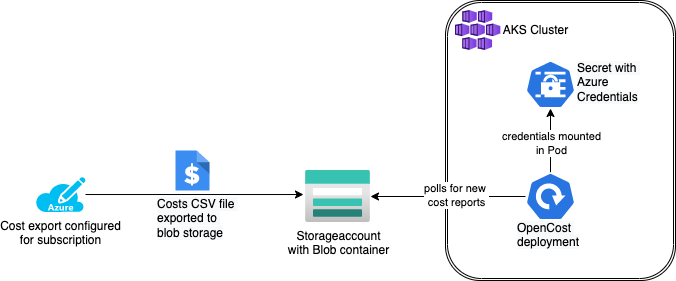
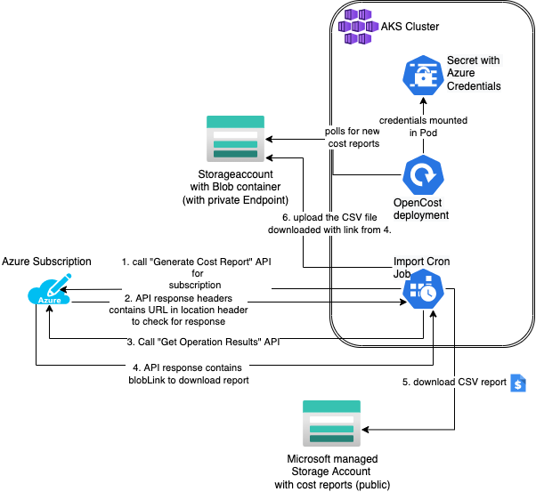

# OpenCost + Azure Cost Export for out-of-cluster costs

[OpenCost](https://www.opencost.io/) enables you to visualize and measure the costs produced by kubernetes workloads:

_OpenCost is a vendor-neutral open source project for measuring and allocating infrastructure and container costs in real time._ (source: OpenCost.io)

It is nice to see what deployment or persistent volume is causing you which costs. But apart from these compute and storage costs there might be cost outside your cluster which should included in the overall cost report.

Examples for this type of costs can be PaaS instances like databases (e.g. AWS RDS or Azure PostgreSQL), container registries and other services which are not running inside your clusters.

**Sidenote**: During my tests it wasn't really clear to me what is part of the CNCF Project OpenCost and what is part of KubeCost (and furthermore what is a paid feature of KubeCost). Being a sandbox CNCF project there is still some work left on the documentation side.

## Configuring Azure Cost export

While installing OpenCost inside an Azure Kubernetes Service (_AKS_) cluster I followed the documentation  on the KubeCost page (https://guide.kubecost.com/hc/en-us/articles/4407595936023-Adding-Azure-Out-of-Cluster-Cluster-Costs-into-Kubecost).

Having the Azure cost export configured as documented results in this flow:

On subscription level there is a cost export configured which creates a CSV file on a daily schedule and uploading the export to a blob container inside a storage account. The cost export contains the monthly costs up to the current day.

This works probably fine for most environments.
In our case we are forced to use private endpoints for the Azure services due to security reasons. 
That means the storage account containing the cost export is not reachable from public networks.

This breaks the Azure Cost export functionality. Because the job creating and uploading the cost export CSV file is not coming from a trusted network source but somewhere from a 'unknown' ip range. Since no public access is allowed and no ip addresses are whitelisted the upload fails.

## Kubernetes Cron job to the rescue

If the export cannot be delivered to us then we have to get it ourselves.

Lucky for us there is an Azure API called [Generate Cost Details Report](https://docs.microsoft.com/en-us/rest/api/cost-management/generate-cost-details-report) which is creating exactly the CSV record which can be pushed following the documentation above in your blob container. (Side note: The automated export can be created via API is well using the Azure [Cost Management - Export](https://docs.microsoft.com/en-us/rest/api/cost-management/exports) API.)

The creation has these steps:
1. _Generate Cost Report_ API is called to get the report for a subscription
   - POST Request to `https://management.azure.com/subscriptions/${AZURE_SUBSCRIPTION_ID}/providers/Microsoft.CostManagement/generateCostDetailsReport`
2. the API response has an HTTP header named `location` which contains the URL to check the reports creation result. Extract the URL from the header
3. Call _Get Operation Results_ API to get the report creation result
4. Extract the `blobLink` from the APIs response (Sample response can be found at https://docs.microsoft.com/en-us/rest/api/cost-management/generate-cost-details-report/get-operation-results)
5. Download the CSV report with the `blobLink` from the publicly available Azure provided storage account (the link contains a SAS token for download)
6. upload the CSV report to our own storage container which is secured with a private endpoint

After that flow the normal KubeCost behaviour kicks in. The container is scanned for new reports and they are imported and scanned by the cost engine.

**Gotcha**: The path structure inside our storage container must match what the default Azure exporter is creating.

The schema is: `<exportname>/<time-from>-<time-to>/<exportname>_<random-uuid>.csv`
E.g: `pstest/20220801-20220831/pstest_74ddd963-1d30-427f-90fc-f0a960aa5a80.csv`

This repository contains the required code to create a ConfigMap with a shell script inside in the `deploy` directory.
The script is mounted to a Pod spawned by a CronJob. The image for the pod requires these tools preinstalled: `jq`, `azurecli` and `curl`
